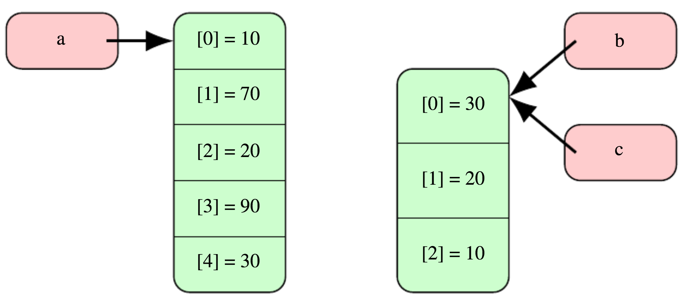

# School of Computing, Macquarie University

## Practical - Introduction, COMP1010

# Outline 

Most of you have done COMP1000 (COMP115) at Macquarie with Processing as the programming language and environment. We will revise some of the basics of programming learnt in COMP1000. Also, in COMP1010, Java is the programming language and Eclipse is the environment. Following are this week's learning outcomes,

- start: introductions
- 20 minutes past start: installation, importing source codes
- 45 minutes past start: Kahoot!
- 60 minutes past start: revise COMP1000/WCOM1000 topics

## COMP1010 Support Structure

In COMP1010, we understand that programming doesn't come naturally to everyone. Some learn faster than others. There are two kinds of support sessions provided in COMP1010. Details are on iLearn. Note: Times and rooms are subject to change. 

## Installing Java SE and Eclipse IDE

Java is the programming language while Eclipse/VSCode are the editors in which you write Java programs. We use Eclipse in the lectures and videos but you are free to choose either. However, we will troubleshoot only Eclipse.

Current version of Java SE is `17.0.2` and Eclipse IDE is `2021-12`.

You must install Java Development Kit (JDK), now known as Java Standard Edition (Java SE), **before you install Eclipse**.

1. Java SE - [https://www.oracle.com/technetwork/java/javase/downloads/index.html](https://www.oracle.com/technetwork/java/javase/downloads/index.html). If you are using Windows, most likely yours is a 64-bit OS. 

2. Eclipse IDE - [https://www.eclipse.org/downloads/](https://www.eclipse.org/downloads/). Download the installer and run it. Choose `Eclipse IDE for Java Developers` from the list of options.

If you have any problem installing Java and/or Eclipse, join one of the **support sessions** and we'll help you out. Please do not ask your lecturer or tutor to sort it during classes as these sessions are not designed for troubleshooting such issues.

NOTE: You can also install and use Visual Studio Code (with "Java Extension Pack" extension) instead of Eclipse. But we don't provide technical support for that.

## Importing project containing all source codes!

Source codes, including lecture and practical class codes, practice packages, and assignment 1 are available under [comp1010\_s1\_2022\_source\_codes\_for\_students\_v1.zip](./../comp1010_source_codes_s1_2022.zip).

1. Open Eclipse
2. Choose `File`
3. Choose `Import`
4. Double-click (or expand) `General`
5. Double-click `Existing projects into Workspace` (NOT Archive File)
6. Choose one of the two options:
	- `Select archive file` to import from archive files (zip files).
	- `Select root directory` to import from directories (in case your browser unzips zip files upon downloading).
7. Click on `Browse`
8. Locate and select zip file/ directory from which to import.
9. Click `Finish`.

## Change package presentation to hierarchical
Note that the packages can be nested. A package `outer.inner` represents a package `inner` inside the package `outer`. You can change the package presentation to hierarchical (recommended) using the process described in the following video:

[](http://www.youtube.com/watch?v=T0Wg5jd6ddw "")

The names of the packages makes their purpose self-explanatory.

The steps required to import one or more java projects contained in a directory or an archive file (zip files) are also shown in the following video:

[](http://www.youtube.com/watch?v=enbPj-RvXdE "")

# Kahoot!

Before we go any further, it's Kahoot time!!!

# Revision

We will go through some questions that will help you revise COMP1000 (COMP115). We have created material for students with the transition from COMP1000 to COMP1010 which is available [here](https://github.com/comp125mq/comp115_to_comp125_transition_workshops). Each topic contains a `.md` file containing the material.

## What is the value of `result` when each of the following codes is executed?

1. 
```java
int result = 17 / 5;
```

2. 
```java
float result = 17 / 5;
```

3. 
```java
float result = 17.0 / 5;
```

4. 
```java
int result = 13 % 5;
```

5. 
```java
int result = -13 % 5;
```

6. 
```java
int result = -13 % -5;
```

## CONDITIONS

Consider the following code:

```java
size(300, 200);
background(255);
int x = (int)random(width);
int y = (int)random(height);
if(x < width/2) {
	if(y < height/2) {
		line(0, 0, x, y);
	}
	else {
		ellipse(x, y, 20, 20);
	}
}
else {
	if(y < height/2) {
		rect(x, y, 20, 20);
	}
	else {
		triangle(x, 0, x, y, 0, y);
	}
}
```

What shapes are drawn for each of the following co-ordinates?

1. `(90, 120)`
2. `(180, 160)`
3. `(40, 80)`
4. `(160, 90)`

## LOOPS

What is the value of `result` when each of the following codes is executed?

1.

```java
int result = 1;
for(int i=0; i<4; i++) {
	result*=2;
}
```

2. 

```java
int n = 64;
int result = 0;
for(int i=1; i*i<=n; i++) {
	result++;
}
```

## CALLING A FUNCTION

What is the value of `result` when the following code is executed? Draw a memory diagram to illustrate the passing of variables. (You can see an example of such a memory diagram [here](https://github.com/comp125mq/comp115_to_comp125_transition_workshops/blob/master/3%20-%20functions/functions.md#defining-a-function)).

Function definition:

```java
int foo(int a, int b) {
	if(a < b)
		return a;
	else
		return b;
}
```

Function call:

```java
int p = 6;
int q = 3;
int result = foo(p - 2, q + 2);
```

## DEFINING A FUNCTION

1. Write a function that when passed an integer, return `true` if it is even (divisible by 2), and `false` otherwise.
2. Write a function that when passed an integer and a boolean,

    - if the boolean value is `true`, return the square of the integer 
    - if the boolean value is `false`,
		- if the integer is positive, return the integer itself
		- if the integer is not positive, return negative of the integer

## STORAGE OF ARRAYS

Discuss this question as a group.

```java
int[] a = {10, 70, 20, 90, 30}; //a refers to an array instance containing 5 items
int[] b = {a[4], a[2], a[0]}; 
//new array instance creating three items from a created, b refers to this instance 
int[] c = b; //c is a reference copy. c and b both refer to the same instance of the array
```

The notation scheme for the memory diagram we will be using is as follows:



## OPERATING ON AN ARRAY

In this unit, we'll be doing a fair amount of problem solving with arrays.

Some key points (assuming an integer array `data`) - 

1. The number of items is given by `data.length`
2. The first item is at index 0 and is given by data[0]
3. The last item is at index `data.length - 1` and is given by data[data.length - 1]
4. You go through each item using the loop header `for(int i=0; i < data.length; i++)` and the current item is given by `data[i]`.

#### EXAMPLE 1

The following code stores, in variable `countPos`, the number of positive values in an array `data`.

```java
int countPos = 0;
for(int i=0; i < data.length; i++) {
	if(data[i] > 0) { //NOT >= since 0 is NOT a positive item
		countPos++;
	}
}
```

#### EXAMPLE 2

The following code stores, in variable `isAsc`, `true` if array `data` is in ascending order, `false` otherwise.

```java
boolean isAsc = true; //assume ascending order
for(int i=0; i < data.length - 1; i++) { //notice the -1 since we are accessing data[i+1] as well
	if(data[i] > data[i+1]) { //an item is more than the next item, violating ascending order rule
		isAsc = false;	
	}
}
```

#### IMPROVEMENT ON EXAMPLE 2

Once `isAsc` changes from `true` to `false`, we don't need to execute the loop further. So we can add `isAsc` to the loop expression.

```java
boolean isAsc = true;
for(int i=0; i < data.length - 1 && isAsc; i++) { //loop terminates if isAsc is false
	if(data[i] > data[i+1]) { 
		isAsc = false;	
	}
}
```

## FUNCTIONS HANDLING ARRAYS

Complete the following functions (we are using Processing syntax here):

```java 
/**
 * return total of all items in the array
 */
int total(int[] data) {
   return 0; //to be completed
}
```

```java
/**
 * return total of all even numbers in the array
 */
int totalEven(int[] data) {
   return 0; //to be completed
}
```

```java
/**
 * return true if all items in data are positive, 
 * false otherwise
 */
boolean allPositives(int[] data) {
   return false; //to be completed
}
```

```java
/**
 * return true if there is at least 
 * one item that exists in both a and b, false otherwise
 */
boolean somethingInCommon(int[] a, int[] b) {
	return false; //to be completed
}
```

## Advanced questions

We understand that some students are quite advanced so here's a section to keep them *entertained*.

#### AQ1 (Advanced question 1)

Define a function that when passed two arrays, returns `true` if they have any item in common, `false` otherwise.

#### AQ2 

Define a function that when passed an array, returns an array containing only the positive items from the array passed.

#### AQ3

A *set* is defined as a collection of unique values. That is, each item in a set occurs exactly once. 

Define a function that when passed an array, returns a *set* version of the array. The order of occurrence of items in the array returned should be the same as the order of the **first** occurrences of the items in the array passed.

For example, if the array passed is `{10, 70, 20, 30, 30, 30, 10, 70, 20}`, return the array `{10, 70, 20, 30}`.

#### AQ4

Define a function that when passed an array, returns a *frequency table* of the array in the form of a two-dimensional array. Each subarray of the array should have two items - 

- the first item holding the value of the item in the passed array
- the second item holding number of times that item exists in the passed array.

The order of occurrence of the first item of each subarray in the array returned should be the same as the order of the **first** occurrences of the items in the array passed.

For example, if the array passed is 

```java
{10, -4, 8, 0, -4, -4, -4, 8, 2, -4, 6, 6, 10, 10, 6}, 
```

return the array 

```java
{{10, 3}, {-4, 5}, {8, 2}, {0, 1}, {2, 1}, {6, 3}}
```
as the item 10 exists 3 times, the item -4 exists 5 times and so on.
