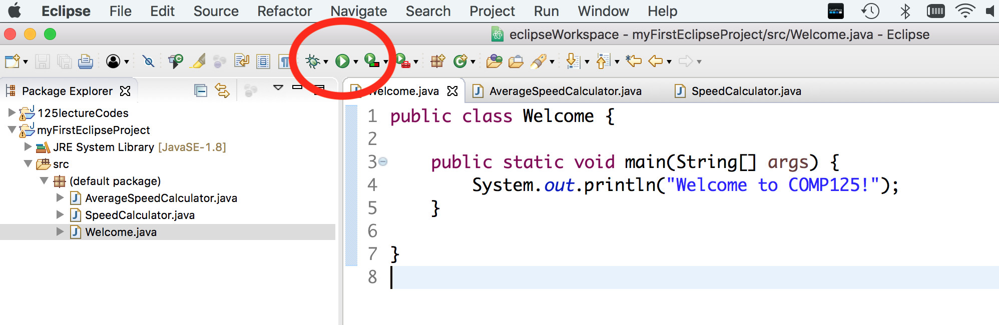

# Department of Computing, Macquarie University
## Workshop - Java and Eclipse basics

# Assumptions

You have downloaded and installed Java SE (previously known as Java SDK) on your computer if you are using it. The software is installed in all Computing laboratories.

## IMPORTANT: Pair up for this lab. If you want to work individually, get permission from your tutor.

## Suggested Timeline 

- 5 minutes past start: Structure of a Java program
- 25 minutes past start: Importing a Java project from an **archive file** in Eclipse
- 35 minutes past start: JUnit test example
- 60 minutes past start: Exporting a Java project to an **archive file** from Eclipse
- 75 minutes past start: Completing a simple Java program
- 90 minutes past start: Problem solving (**extremely useful for practical exam 1**)


## Structure of a Java program

The following is true for basic java programs (the kind we'll see in the beginning). More advanced program structures shall be discussed as needed.

- A basic java program resides in a `.java` file. 
- **By convention**, the file name begins with an uppercase letter and is camel-cased. For example `HelloWorld.java`.
- The first statement in a file named `XYZ.java` is the class header and must be:
		
```java
public class XYZ {
```

### Question 1.

Which of the following should be the first statement in a file named `Hello.java`?
	
1. `public class Hello {` 
2. `public class hello {`
3. `class Hello {`
4. `class hello {`


A class is like a container for java programs. A *runnable* java program contains a `main` method with the following **header** inside the class.

The header of the `main` method is:

```java
public static void main(String[] args)
```

- `public` means it can be seen by any other code in the program.
- `static` will be covered later.
- `void` because the method doesn't return any value.
- `main` is a special reserved name for this method (like `draw` in Processing).
- `String[]` means it accepts an array of Strings as parameter. We don't use that in this unit but that has to be there.
- `args` is the formal parameter name. We can use any valid value for a literal instead of this.

### Question 2.

Which of the following are valid headers for the `main` method?
	
1. `public static void main()`
2. `public void main(String[] args)`
3. `public static void main(String[] tom)`
4. `public static void Main(String[] jerry)`
5. `public static void main(int[] args)`
6. `public static void main(String args)`
7. `public void main(String args)`
8. `public static void main(String[] args)`

## The complete picture

So, with the class header outside and the method header inside, a java program looks like this:

```java
public class MyFirstProgram {
	public static void main(String[] args) {
		//your code goes here
	}
}
```

### Example 1

[MyFirstProgram.java](./codes/MyFirstProgram.java)

### Example 2 - *Chunkier*

[ChangeCalculator.java](./codes/ChangeCalculator.java)

### Question 3.

1. Create a new Java project named `simpleJavaProject`.
	1. **DO NOT create** `module-info.java` when prompted.
2. Right click on project and choose `New` -> `Class`. 
3. Choose the name `Product`.
	1. Make sure you enable the box for including `public static void main(String[] args)`.
4. In the `main` method of file `Product.java`, initialize two integers with names and values of your choice and display their product. Values are displayed using `System.out.println` method.
5. Run the program using the *Play* button. For example, if the variables hold the values 4 and 9, you should see the value 36 in the console. 

### Importing a Java project from directories or archive files in Eclipse

Luckily, we have sophisticated softwares known as *Integrated Development Environments* (IDE) that offer extensive GUI and functionalities that we don't have to compile and execute programs through command prompt.

The IDE we use in the labs is Eclipse, although you are free to use others such as IntelliJ and NetBeans. However, we use Eclipse in all our tutorials and videos and only provide support for Eclipse.

One of the good things about using an IDE is that you can *package* or export a program (that may contain many many files) into an archive file (.zip). You can then *unpackage* or import the program from an archive file into an IDE on a different machine.

The steps required to import one or more java projects contained in a directory or an archive file (zip files) are as follows:

1. Open Eclipse
2. Choose `File`
3. Choose `Import`
4. Double-click (or expand) `General`
5. Double-click `Existing projects into Workspace`
6. Choose the options
	- `Select archive file` to import from archive files (zip files).
	- `Select root directory` to import from directories.
7. Click on `Browse`
8. Locate and select directory or archive file from which you are importing.
9. Click `Finish`

### Question 4.

Import project contained in [myFirstEclipseArchiveFile.zip](./codes/myFirstEclipseArchiveFile.zip). There should be a project `myFirstEclipseProject` when imported containing the following structure:

- `myFirstEclipseProject`
	- `src`
		- `(default package)`
			- `AverageSpeedCalculator.java`
			- `SpeedCalculator.java`
			- `Welcome.java`

### Question 5.

Double click on `Welcome.java` and run it using the Play Button.



You should see the output in the console.

Repeat the same with `SpeedCalculator.java`

### Question 6.

Complete the steps described in the program `AverageSpeedCalculator.java` so that the average speed of a return trip is calculated. The output should be 15.384....

**TIP** `int/int = int` while `int/double = double`

### Exporting a Java project to an ***archive file*** from Eclipse

Export the completed project to an archive file using the following steps:

1. Select the project `myFirstEclipseProject` in the left panel so that it is highlighted in blue.
2. Choose `File`
3. Choose `Export`
4. Double-click (or expand) `General`
5. Double-click `Archive file`.
6. Make sure `myFirstEclipseProject` has a tick against it.
7. Click on `Browse`.
8. Choose location of your choice and choose the name `myFirstExportedArchive`.
9. Click `Finish`

### Question 7.

Download the project from [practical templates archive file](./../practicalTemplates.zip). This relates to the questions under package `week02.practicePackage`.

Each file contains a method you need to complete followed by the corresponding test (indicated by `@Test`). Your tutor will demonstrate test-driven programming using:

- `Question01.java` (test for method returning `boolean`), and, 
- `Question02.java`(test for method returning `int`).

Based on that, complete `Question03.java` and `Question04.java` and run corresponding tests.

# Submission activity for this week

For week 2, the submission required is the exported project for **Question 7**. You can make the submission by **Sunday 8th March 21:00**. You pass this activity if tests for **15 or more tests pass**. We suggest you attempt the 4 advanced questions after the other 26 questions. 

The more methods you can solve, the better are your prospects in the practical exams. After completing the methods, follow the steps from Question 6 to export to archive file. Name the archive file `studentID.zip` where `studentID` is your 8-digit Student ID and upload this file under `Week 2 submission`.

### Question 8 (Problem solving)

This question must be answered **on a piece of paper** that must be returned to the tutor once you've finished.

#### Sub-task 1

Complete the body of the method `sumIndexRange` that returns the sum of all items in the index range in the array passed. Some examples,

- `data = {10, 70, 20, 90, 30}`, `idx1 = 1`, `idx2 = 3` 
	
	--> return `70+20+90` = `180`

- `data = {10, 70, 20, 90, 30}`, `idx1 = 2`, `idx2 = 2` 
	
	--> return `20`
	
```java
public static int sumIndexRange(int[] data, int idx1, int idx2) {
	return 0;
	//so that there is no compilation error. 
	//remove this statement before writing your code.
}
```

 ***Only if you struggle***, access the pseudo-code provided [here](./sumIndexRangePseudoCode.md).

#### Sub-task 2

Complete the body of the method `isBalanced` that assumes that the array passed has an even number of items, and returns `true` if the sum of items in the first half of the array equals the sum of items in the second half of the array, `false` otherwise. 

You **SHOULD** (meaningfully) call the method *sumIndexRange*, even if you didn't finish it or get it right.

For example,

- `data = {10, 70, 20, 80, 0, 20}` --> return `true`
- `data = {10, 70, 20, 10, 10, 80, -50, 70}` --> return `true`
- `data = {10, 70, 80, 20}` --> return `false`

```java
public static boolean isBalanced(int[] data) {
	return false; 
	//so that there is no compilation error. 
	//remove this statement before writing your code.
}
```

## Extra questions for students who want/ need to be challenged 

Solve the following problems (in order of my perception of difficulty) from `codingbat`. Solutions to these will not be released. But you are free to search them online.

Adv1. [https://codingbat.com/prob/p109783](https://codingbat.com/prob/p109783)

Adv2. [https://codingbat.com/prob/p193753](https://codingbat.com/prob/p193753)

Adv3. [https://codingbat.com/prob/p153059](https://codingbat.com/prob/p153059)

Adv4. [https://codingbat.com/prob/p193817](https://codingbat.com/prob/p193817)

Adv5. [https://codingbat.com/prob/p134022](https://codingbat.com/prob/p134022)

Adv6. [https://codingbat.com/prob/p189576](https://codingbat.com/prob/p189576) 
