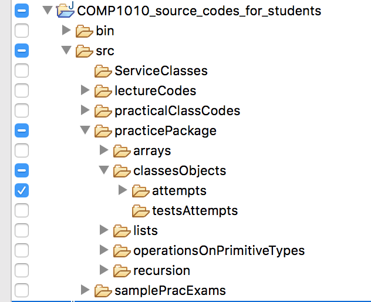

# Department of Computing, Macquarie University

## Workshop - Classes and Objects

# NOTE

We will continue working with the `COMP1010_source_codes_for_students` project. This week, we are dealing with package `practicalClassCodes.week05`.

## Outline

- designing a class
- creating objects
- constructors
- compareTo

## Question 1

Design classes (no implementation) that encapsulate the following real life entities. 
	- Add up to three instance variables for each class. Select the three most important attributes if you think a class has more than three attributes.
	- Add up to three instance methods that objects of this class may exhibit.

#### 1. Person

<!--
### SOLUTION
	
#### Instance variables:
	
1. name: text
	
2. yearOfBirth: integer
	
3. gender: integer (0 - male, 1 - female, 2 - transgender, ...)
	
#### Instance methods:
	
1. initials(): text (initials of "Harry Potter" are "HP")
	
2. age(): integer
	
3. isMale() or isFemale(): boolean
-->

	
#### 2. Cylinder (Take-home exercise)

<!--
### SOLUTION
	
#### Instance variables:
	
1. radius: real number
	
2. height: real number

#### Instance methods:
	
1. volume(): real number
	
2. surfaceArea(): real number
	
3. diameter(): real number
-->
	
#### 3. Book (Take-home exercise)

<!--
### SOLUTION
	
#### Instance variables:
	
1. title: text
	
2. authors: text
	
3. genre: text
	
#### Instance methods:
	
none needed
-->
	
## Question 2

#### Part 1

Consider the following class definition:

```java
public class Date {
        public int day, month, year;
}
```

In a client code (outside the class `Date`), create an object to represent the date *13th April, 2011*. 

<!--### Solution

```java
Date graduation = new Date();
graduation.day = 13;
graduation.month = 4;
graduation.year = 2011;
```-->

#### Part 2

**(Take-home exercise)** Consider the following class definition,

```java

public class Car {
	public String model;
	public int price;
}
```

In a client code (outside the class `Car`), create an object to represent a *Toyota Corolla* priced at *$21,999*.

<!--### Solution

  ```java
Car myCar = new Car();
myCar.model = "Toyota Corolla";
myCar.price = 21999;
```
-->

## Question 3

#### Part 1

Declare and instantiate an object `baddy` of class `Person` written in the previous part, representing a person named *Tom Marvolo Riddle* aged *71*.

<!--### Solution
```java
Person baddy = new Person();
baddy.name = "Tom Marvolo Riddle";
baddy.age = 71;
```
-->

#### Part 2

List the mistakes (syntactical and logical) in the following constructor for class `Person`:

```java
public void person(String s, int a) {
	name = s;
	age = a;
}
```

<!--### Solution

1. Constructor should have no return type, not even void.
2. Name of constructor should be exactly the same as the class name. So, Person, not person.

Fixed constructor:

```java
public Person(String s, int a) {
	name = s;
	age = a;
}
```
-->

#### Part 3

Add a constructor to class `Person` with a single parameter for the instance variable `name`. The instance variable `age` should be set to 21.

<!--### Solution

```java
public Person(String s) {
        name = s;
        age = 18;
}
```
-->

#### Part 4 (take-home question)

Assuming the constructor has been added to class `Person` according to the previous part, will the following statement run successfully or result in a compilation error? Explain your answer. If there is a compilation error, what should be done to fix it?

```java
Person p = new Person();
```

<!--
### Solution

It will result in a compilation error since once parameterized constructors are defined, Java expects us to define the default constructor as well, and the default constructor that Java provides is no longer valid. The solution, therefore, is to add a default constructor.

```java
public Person() {
        name = "anonymous";
        age = 0;
}
```
-->

## Question 4 (`compareTo` method)

Consider the class `GoalScoringRecord` in the project contained in `workshopClassesObjectsTemplate.zip`. Complete the method `compareTo` so the corresponding test supplied in class `GoalScoringRecordTest` passes.

<!--### Solution
-->

## Question 5 

This question is based on the class `Rectangle` in the project contained in `workshopClassesObjectsTemplate.zip`.

Draw the memory diagram that represents the objects and instances when `line 8` in the follwing code is reached. Please refer to the lecture notes to see the representation scheme we have established.

```java
Rectangle r = new Rectangle(10, 20);
Rectangle s = r;
Rectangle t = s;
Rectangle v = new Rectangle(10, 20);
r.height = 8;
r = v;
t = null;
System.out.println(r);
System.out.println(s);
System.out.println(t);
System.out.println(v);
```

## Question 6

For the class `Rectangle` in the project contained in `workshopClassesObjectsTemplate.zip`, consider the following client code (outside `Rectangle` class):

```java
Rectangle[] data = new Rectangle[5];
```


1. Draw the memory diagram representing the storage of array `data`.
2.	What is the output of the following client code:

	```java
	for(int i=0; i < data.length; i++) {
		System.out.println(data[i]);
	}
	```

	<!--### SOLUTION
	```bash
	null
	null
	null
	null
	null
	```-->

3. 	Instantiate each item of the array so that,
	- the first item represents a square with `width=1, height=1`.
	- the second item represents a square with `width=2, height=2`.
	- the third item represents a square with `width=3, height=3`.
	- the fourth item represents a square with `width=4, height=4`.
	- the fifth item represents a square with `width=5, height=5`.

	<!--## SOLUTION
	
	```java
	for(int i=0; i < data.length; i++) {
		data[i] = new Rectangle(i+1); //square constructor exists
	}
	```-->

4. 	Draw the updated memory diagram after the items have been instantiated.

## Question 7

Complete the method `countSquares` (in class `RectangleClient.java`) that when passed an array of `Rectangle` objects, returns the number of squares in the array. Note that the class `Rectangle` contains an intance method `isSquare()` that you can call.

You may assume that the array passed and also every `Rectangle` in the array is instantiated. For a more comprehensive design, avoid that assumption, so the array might be uninstantiated or null, or if it is (instantiated), some `Rectangle` objects in the array might be uninstantiated or null.

Test provided in `testCountSquares` in class `RectangleClientTest.java`.

<!--
## SOLUTION
	
#### Without assumption:

```java
public static int countSquares(Rectangle[] data) {
	int count = 0;
	for(int i=0; i < data.length; i++) {
		if(data[i].isSquare()) {
			count++;
		}
	}
	return count;
}
```

#### Without assumption:

```java
public static int countSquares(Rectangle[] data) {
	if(data == null) { //nothing inside
		return 0;
	}
	
	int count = 0;
	for(int i=0; i < data.length; i++) {
		if(data[i] != null && data[i].isSquare()) { //first make sure it's not null
			count++;
		}
	}
	return count;
}
```
-->

## Submission for week 5


You should work on the practice package for **classesObjects** for the rest of the time. It's in `practicePackage.classesObjects.attempts`, corresponding tests under `practicePackage.classesObjects.testsAttempts`. The file `AllInOneTest.java` contains tests for all the classes. There are a total of 25 tests. Your submission must pass at least 10 tests (any 10) to get a *pass* mark. 

Make the submission as an exported archive file (select ONLY package `practicePackage.classesObjects.attempts` under the `src` folder, NOT the `bin` folder) named `studentID.zip` (where studentID is your Student ID) on iLearn under "Week 5 submission" by **Sunday 29th March, 21:00**.



**DUE DATE: Sunday 1st September, 21:00 (9:00pm)**

# ADVANCED QUESTIONS (HD level)

1. Write a method `groupSameAreas` in class `Advanced` that when passed an array of `Rectangle` objects (say `data`), returns a two-dimensional array of `Rectangle` objects (say `buckets`), such that all objects from `data` with the same area are in the same one-dimensional array in `buckets`. That is,

	- all objects in the one-dimensional array `buckets[0]` have the same area,
	- all objects in the one-dimensional array `buckets[1]` have the same area, 
	- all objects in the one-dimensional array `buckets[2]` have the same area, 
	- all objects in the one-dimensional array `buckets[3]` have the same area, 
	- and so on...

2. (Not related to classes and objects but aimed at students who might want something a little ... extra). Complete the method `longestRecurringSequence` in class `Advanced` that returns the longest sequence of items that occurs more than once in the array. return the array that occurs first in case of a tie.
